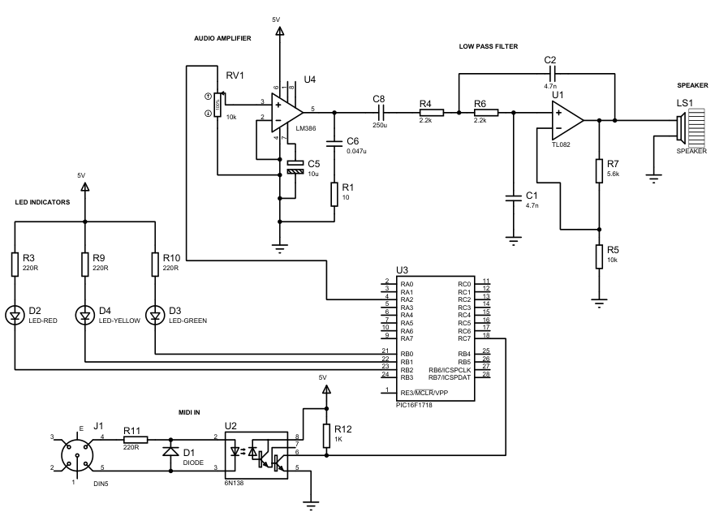

# Micro Synth

A microcontroller-based digital synthesizer built with the PIC16F1718 that receives MIDI input and generates real-time audio output using wavetable synthesis.

<p align="center">
  
</p>

## Features

- **MIDI 1.0 Compliance**: Receives note-on and note-off messages via standard MIDI protocol
- **Three Waveforms**: Sine, sawtooth, and square wave synthesis  
- **Real-time Audio**: 29.4 kHz sampling rate with 8-bit DAC output
- **Monophonic Operation**: Single-note melody playback
- **Visual Feedback**: LED indicators for system status and MIDI activity
- **Educational Design**: Breadboard-friendly for learning and experimentation

## Hardware Requirements

### Core Components
- **PIC16F1718** microcontroller (28-pin DIP)
- **6N138** opto-isolator for MIDI input
- **LM386** audio amplifier
- **TL082** op-amp for low-pass filter
- Standard electronic components (resistors, capacitors, LEDs)

### MIDI Interface
- DIN5 connector for MIDI input
- MIDI-compliant keyboard or controller

### Development Tools
- **MPLAB PICkit 5** In-Circuit Debugger
- **MPLAB X IDE** for development

## Technical Specifications

| Parameter | Value |
|-----------|-------|
| Microcontroller | PIC16F1718 |
| Clock Frequency | 16 MHz |
| Sampling Rate | 29.4 kHz |
| DAC Resolution | 8-bit |
| Wavetable Length | 4,096 samples |
| MIDI Baud Rate | 31.25 kBaud |
| Note Range | MIDI notes 48-72 (C3-C5) |
| Audio Output | Mono, amplified |

## Software Architecture

### Key Features
- **Interrupt-driven MIDI processing** using EUSART
- **Timer0-based audio sampling** at 29.4 kHz
- **Wavetable synthesis** with pre-calculated waveforms
- **Integer-based phase accumulation** for efficient real-time operation

### Waveform Generation
- **Sine Wave**: Pure fundamental frequency using lookup table
- **Sawtooth Wave**: Rich harmonic content with anti-aliasing filter
- **Square Wave**: Odd harmonics only, calculated in real-time

## Getting Started

### Prerequisites
- [MPLAB X IDE](https://www.microchip.com/mplab/mplab-x-ide) (latest version)
- MPLAB XC8 Compiler
- PICkit 5 programmer/debugger

### Building the Project

1. **Clone this repository**
   ```bash
   git clone https://github.com/charlesmulder/microsynth.git
   cd microsynth
   ```

2. **Open the project in MPLAB X IDE**
   - File → Open Project
   - Navigate to the cloned directory
   - Select the project

3. **Build the project**
   - Build → Build Project (`Ctrl+F11`)

4. **Program the PIC16F1718**
   - Connect PICkit 5 programmer
   - Run → Program Device (`Ctrl+F5`)

### Hardware Setup

1. **Assemble the circuit** on a breadboard following the schematic

2. **Connect the PICkit 5 programmer:**
   ```
   PICkit 5    →    PIC16F1718
   Pin 1 (MCLR) →   Pin 1
   Pin 2 (VDD)  →   Pin 20
   Pin 3 (GND)  →   Pins 8,19
   Pin 4 (PGD)  →   Pin 28
   Pin 5 (PGC)  →   Pin 27
   ```

3. **Connect peripherals:**
   - MIDI keyboard to DIN5 connector
   - Speaker to audio output

## Usage

### LED Status Indicators
| LED Color | Status | Description |
|-----------|--------|-------------|
| 🟢 Green | MIDI Activity | On when note is playing |
| 🟡 Yellow | Framing Error | EUSART error (auto-reset) |
| 🔴 Red | Buffer Overrun | Requires restart |

### MIDI Channel Selection
- **Channel 1**: 🌊 Sine wave
- **Channel 2**: ⬜ Square wave  
- **Channel 3+**: ⚡ Sawtooth wave

### Supported MIDI Messages
- `Note-on` (0x90-0x9F)
- `Note-off` (0x80-0x8F)
- Running status for efficient message handling

## Circuit Schematic

The complete circuit includes:
- MIDI input isolation circuit
- PIC16F1718 microcontroller
- Audio amplifier with gain control
- 2-pole Butterworth low-pass filter (14.7 kHz cutoff)
- LED status indicators

> 📖 See the [full project documentation](docs/microsynth-report.pdf) for detailed schematics and component values.

## Limitations

- **Monophonic**: Only one note can play at a time
- **Pitch Accuracy**: Integer sampling increments cause slight pitch devi
